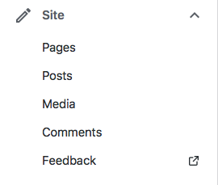
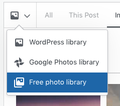
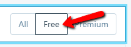
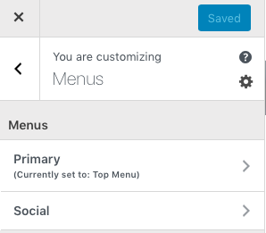

# Account Setup and First Blog Post with Wordpress
 
**Introduction to Personal Websites with WordPress #1: Getting Started** 
In this exercise, you will create your own Wordpress website that would be suitable for a personal portfolio. If you have any questions or get stuck as you work through this, please ask your instructor for assistance. Have fun!

1. Before you set up your website, let’s make sure that you’re prepared... Begin with the end in mind:
  - Have you looked at other portfolio websites on the internet for inspiration?  If not, take 5 minutes and google “portfolio websites”, and make notes about things you would like to include in your website (e.g. layout, look & feel menus, and pages or features.)
  - Do you have ideas for a name for your website? _________________________________
  - Do you have a list of pages and/or sections for your website? Eg: Resume, portfolio, blog...
  - Do you have a top-level navigation structure in mind for your website (usually at the top of every web page? Eg: Home, Portfolio, About, Blog, Contact)
  - Did you create a pen and paper outline of what you want your website to look like?  If you did, this will be a great guide as you look at different Wordpress template options.

2. Create a Wordpress account:
  - In your web browser, navigate to: [Wordpress](https://wordpress.com){:target="_blank"} and create a new Wordpress account and username. Don’t worry too much about what your username will be, because you will pick a different name for your website address. 
  - Once you create an account, it will prompt you to create a domain -- this will be the address people will type in to go to your website. Most people use their name for their portfolio to get started, or use a name for a business idea they have. If your name is already taken, try adding your middle initial or spelling out your middle name. Keep in mind that you can have multiple free websites in your Wordpress account so this can also be a practice website and you can choose one with a different name later. 

  - When you fill in your idea in the form at the top, a large list of ideas will come up, most of them for paid domains. However, at least one of them will be for a free option. If you don’t like the option that comes up, you can try entering another name and see what comes up. Sometimes they will be in the format of janedoe.home.blog or janedoe.wordpress.com
  - Once you’ve chosen a Free domain, click on the Select button next to it. This will bring you to a page offering you options for various tiers of Wordpress accounts. Just at the top is an option for starting with a free site. Click the link to “**Start with a free site**”.
 
  - Congratulations, you’ve created a “shell” or blank Wordpress website! 

3. Create some content for your website by writing a blog post with an image and video:
 
  - In the left sidebar navigation, click on **Site** and then **Posts** and then click on the red button in the top right of the page that says **Add New Post**. 
  - Give the post a title, and then type some text in the field below the title.
 
   
  - Now let’s add an image by first clicking on the down arrow in the menu just above your post text to bring up the additional menu options, and click on **Inline Image**. This will bring up a pop up menu with an image gallery. If you click on the little **Image icon** with the down arrow and then on **Free photo library**, you can search for more photos to use. When you find an image you want, click **Copy to media library** and then **Insert**.
  
  - To resize the image, click on it and change the image width by entering a number of pixels. 
  
  - Next, copy and paste a YouTube URL onto the last line of the blog post.
   
  - Publish these changes by selecting the blue **Publish** button at the top right of page and again to confirm. Congratulations on your first blog post! (Note: your site does not get launched publicly until you verify your account with your email address.) 
  - Return to the Wordpress admin page by clicking the **back arrow** in the top left of the page.

4. Let’s add an “About” web page to showcase professional information about yourself:
  - Select **Pages** on the left navigation bar and then click on the red button in the middle of the page that says **Add New Page**, and then select the **About page template**. Click on the blue **Use About layout** button in the top right corner.
  - Type some information about yourself in the fields below. If there is a photo, you can replace it with another one by clicking on it to bring up the **Replace** option. 
  - Publish this page by selecting the **Publish** button in the top right of the webpage, and then a second time to confirm.  
  
  - Return to the Wordpress admin page by clicking the back arrow in the top left of the page.
  - Add as many pages as you want for your website.

5. Select a new template to change the look and feel of your website:
  - In the left toolbar, click on **Design** and then click on **Themes**. Scroll to the bottom of the themes and click on the Show All Themes button.
 
  - Now press the **Free** button on the right side of the web page so that all of the paid templates are hidden.
  - Select the template you want, by clicking on the theme image. Note: The rest of this tutorial will use the **Twenty Seventeen** theme which we recommend you search for. Customization options depend on which theme you choose.
  
  - Click on the one you want and then click the **Activate this design** button near the top middle of the webpage. You can switch to other themes later, too. When prompted click on **Customize site**.
 
 
6. Customize your new website template: 
  - Click on **Site Identity** and then **Site Title** in the left sidebar to give your site a name. Click on the **Save Changes** button. And then click the back arrow next to Site Identity to get back to the menu. 
   
  - Select the **Menus** button in the left toolbar, and then select **Primary**. (Note, if you have not confirmed your email address, you’ll need to do that step now.)
  - Your menu list will show up under Primary. If you created pages and do not see them on this list, Click on the **Add Items** button in the left toolbar.
  - Add a page by clicking on the page title link in the toolbar that just popped up. 
  - Select the checkbox beside **Automatically, add new top-level pages to this menu** at the bottom of the left menu.
  - Press the blue **Save Changes** button at the top of the webpage. You are now looking at a preview of your website.
  - To make other customizations to your website click the back arrow next to Primary to get back to Menus and then again to get back into Customizing.
    
  - Let’s change the main website photo by selecting the **Header Media** option, and then the **Add new image** button in the left toolbar. 
  - You can now upload a photo you’d like to use, or click on the **Media Library** tab in the top left of the webpage to select one of the images you’re already using on your website.  
  - Select an image, and then click on **Select and Crop** in the bottom right of the webpage. Press the blue Save Changes button at the top left of the webpage.
 
   
  - Lastly, press the Launch site button at the top right to make your new website live to the public! Congratulations on creating a website for yourself! 

**If you are met with another page asking you to give your site an address, the last option should be the first domain you chose with the option to “Skip Purchase”. And another page to Start with a free site.**

[NEXT STEP: Categories and Navigation](categories-navigation.html){: .btn .btn-blue }

