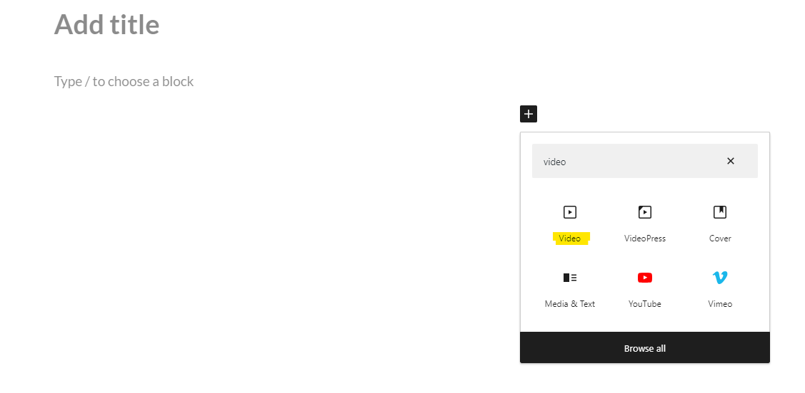
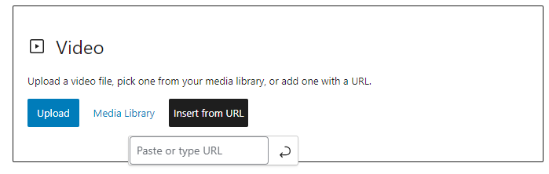
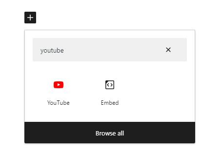
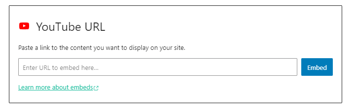

# Adding and Embedding Videos

In this exercise, you will learn how to add and embed downloaded videos and Youtube videos to your blog post. 

### Adding Downloaded Videos
-  If you don’t have a video that you want to edit, let’s start by downloading [this video](http://bit.ly/dsc-goat-video){:target="_blank"}, and saving it to your desktop. It may take 1 or 2 minutes to download. **Note**: If the video starts playing you will have to right mouse click on the video and select “**Save Video As**…” to save it to your computer’s desktop using the name goat video.
-   First click the black + square and in the search bar write **video**. Click on the video icon.
   
-    Next click **upload**. find the file of the goat video by searching the file name or finding it on your desktop and selecting the file. Then click open.
-  That should add the video within your blog post
-   If you wish to remove the video, you must click on the video and press the backspace.
-  There are numerous settings on the right side bar, you are welcome to adjust and try them out according to your needs. There are the following options: autoplay, loop, muted, playback controls and play inline. Feel free to toggle any of those on. 

### Adding a URL or Youtube video
**Option 1:**
- Like the first step of adding a dowloaded video, click the black + square and in the search bar write **video** and click on the video icon.
- Instead of clicking upload, click **insert from URL**
 
- Insert your desired URL here
  
**Option 2:**
- click the black + square and in the search bar you search **Youtube** instead of video and the icon will come up. Either option works. 
   
- Next add the Youtube URL and click **embed**
  

[Visit this workshop for more information about video editing using H5P in your wordpress site](https://uviclibraries.github.io/video-editing/h5p.html){:target="_blank"} 

[NEXT STEP: Categories and Navigation](categories-navigation.html){: .btn .btn-blue }
