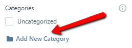
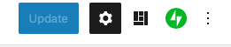
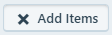

# Categories & Navigation

In this exercise, you will create categories for your blog posts, and then create top-level navigation menu items for one or more categories. The animations and instructions below use Wordpress.com, which differs slightly from the OpenEd user interface. If you have any questions or get stuck as you work through this, please ask your instructor for assistance. Have fun!

1. Create new categories for your blog posts:
  - Click Posts and choose one of the posts you have created. Click on it to open and edit it. 
  - Give your blog post a name and a little bit of text.
   
  - Click on the **Categories** drop-down in the right side toolbar. (If you don’t see this, click on the **Settings** button shaped like a cog in the upper left corner to open the left menu bar.)
  - Click on the **Add New Category** link, and then type a category name (e.g., Update, Personal, Tech Inquiry, etc) and then press the **Add New Category** button.
  - Type another category name in the field, then press the **Add New Category** button. 
  - Uncheck all categories that might not relate to this post.
      
  - Press the blue **Update** button on the top right of the page.
  - Click on the black W in the upper left corner to go back to your dashboard.
   

  <button onclick="toggle('gif1')">Show / Hide Animation </button>
  

  
  

2. Make the two new categories top-level menu items:
  - In your dashboard, under Design, select the **Customize** from the left navigation menu.
  - Select the **Menus** button in the left toolbar, and then select **Primary**.
  - Click on the **+ Add Items** button in the left toolbar.  
  - Click on the **Categories** drop-down menu.
  - Click on the categories that you recently created to add them to your website menu.
  - Click the **Save Changes** button on the top right of the page. Click the X button on the top left to go back to the admin dashboard page. 

  <button onclick="toggle('gif2')">Show / Hide Animation </button>
  

  
  

  
3. Now let’s increase the RSS feed limit from 10 to 50 blog posts:
  - Click on the **Settings** menu item on the bottom of the left menu.
  - Click on the **Writing** tab in the top middle of the page.
  - Scroll down the page to the “**Feed Settings**” section and change the number of most recent blog posts from 10 to 50. 
    _*Note: if using OpenEd, navigate to the **Reading** tab instead to change blog post settings - the feed settings option is not available._
  - Next press the **Save Settings** button on the right side of the Feed Settings section. 

  <button onclick="toggle('gif3')">Show / Hide Animation </button>
  

  
  

**Congratulations! You have created a customized personal website!**

[NEXT STEP: Adding and Embedding Videos](add-videos.html){: .btn .btn-blue }
