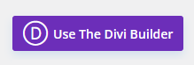
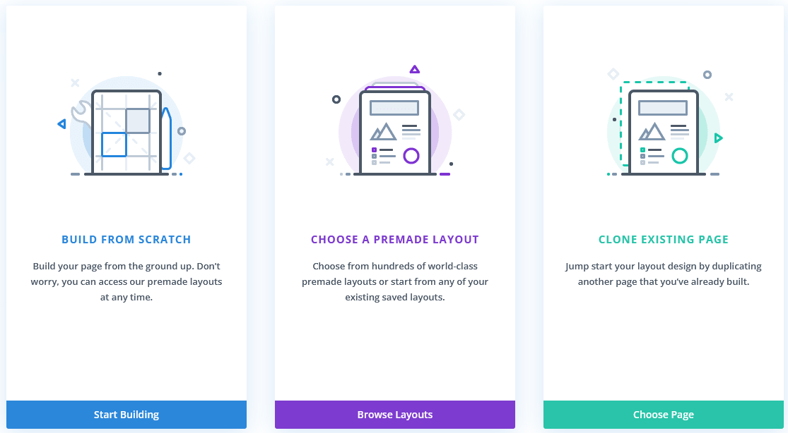
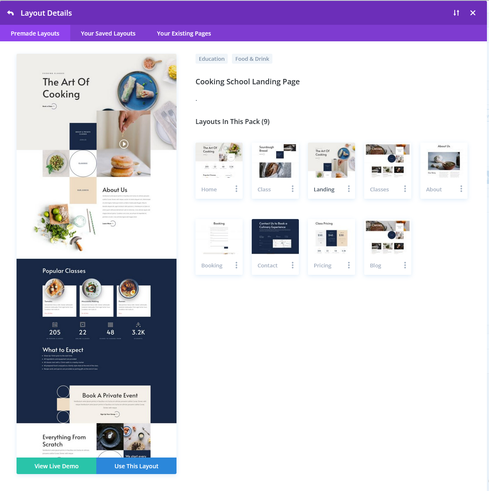
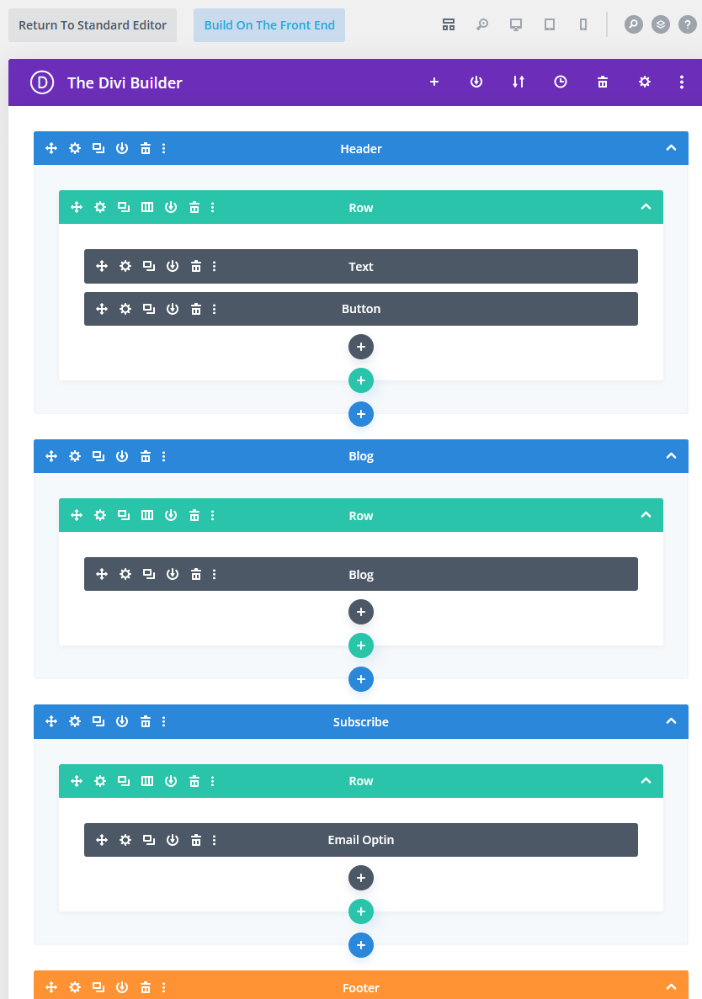

# UVic's Online Academic Community and the Divi Theme - Adding a Layout

In this exercise, we will create our first page and take a look through the vast collection of layout sets available in the Divi Theme. **To do this activity, you may have to have your Divi account activated by LTSI already..**  If you have any questions or get stuck as you work through this, please ask your instructor for assistance. Have fun!

1. **Create a Page**
  - From the Dashboard of your site, click on **Page** in the left sidebar menu and then click on **Add New**. 
  - Click on the **Use the Divi Builder** button. Then three options will pop up. Click on **Browse Layouts**. This will bring up the Layout Packs Library. This is an extensive collection of layouts available to use (as of creating this tutorial, 2547 layouts are available in 347 layout packs). 
  - Scroll through and choose one that you like the general look of (in these screenshots, Cooking School layout was used), and then click on it to see the Page layouts available inside that pack. You can click on the individual thumbnails to see a larger version, and scroll down through its preview to see what the full page looks like. Once you find a page layout that you think will work for your first page, click on the **Use This Layout** button to apply it to your page.
  - Note: If you have had your OAC Divi theme authenticated by LTSI and are working on it again after some time has elapsed, there might be a log in request that comes up expecting you to have an Elegant Themes account to proceed. If this happens, email the URL of your site to ltsisupport@uvic.ca and let them know you are using the Divi theme and this has occured and they will clear it for you. 

2. **Build on the Back End**:
  - Once loaded, you will see the back end of your new page, with a bunch of nested Sections (blue or orange), Rows (green), and Modules (dark grey). Each of these can be dragged and dropped to reorganize them, and have various icons to access to change their many settings.  
  - You can click on the round plus (+) signs to add new Sections, Rows, and Modules. 
  - Each of these are full of nested tabs full of expandable settings menus. See step 4 below for a link to extensive documentation and tutorial videos to help you navigate these settings. 

3. **Build on the Front End**:
  - An alternative to make this a bit less intimidating, you can also edit your Divi pages and posts on the Front End by clicking on the **Build on the Front End** button at the top. 
  - Once the editable Front End of your new page loads, you can run your mouse over the Sections, Rows, and Modules and they will highlight in the same colours they had in the Back End, and the same settings icons will appear. 
  - You can click directly into text boxes to edit the text areas. 

4. **Divi Settings**
  - The settings in each of these Sections, Rows, and Modules are tabbed and nested with extensive options for customization, which can be a little overwhelming. Thankfully, there is documentation available for all of the modules and customization options here: [Divi Documentation Page](https://www.elegantthemes.com/documentation/divi/){:target="_blank"}

**Congratulations! You've installed your first layout!** 

[NEXT STEP: Earn a Workshop Badge](informal-credentials.html){: .btn .btn-blue }
